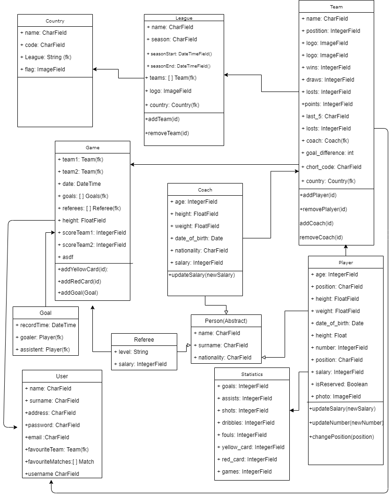

# DJangoFootballApp
  In fact that football is a very popular sport in the world. 
  People who interested with football, approximetly 2.9 billion in our planet. 
  Problem: fans of football spend a lot of time to search some information about match or match reviewing on the Internet. 
  For this reason as backend of football application you can use our DjangoFootballApp.
  
  About App:
  Models in our django project: Country, League, Team, Player, Statistics, Person, Coach, User, Goal, Referee
  There is one abstract class Person and three child class: Player, Referee, Coach. Because they have some common fields.
  User of our project was extended from AbstractUser and added some fields like: address, favourite team, favourite matches.
  In fact that every football fan has a favourite team. In app they can choose team and see all matches and news releted with this team.
  Field favourite mathces save mathces in similar way. You will be able to get access quickly.
  In project was used JWT token for authentication. We use rest_framework for CRUD operation.
  
  Features:
  Top Football Leagues
  League detail (teams, stats, matches, logo, date)
  Team detail (plalyer, matches,wins, losts, coach, logo, position, short code, country)
  Choose date and follow matches on that date
  Ability to choose your favorite competitions and teams and follow them
 
  Authors: ( https://github.com/Yeldarmt , https://github.com/maymashd )
  
 

